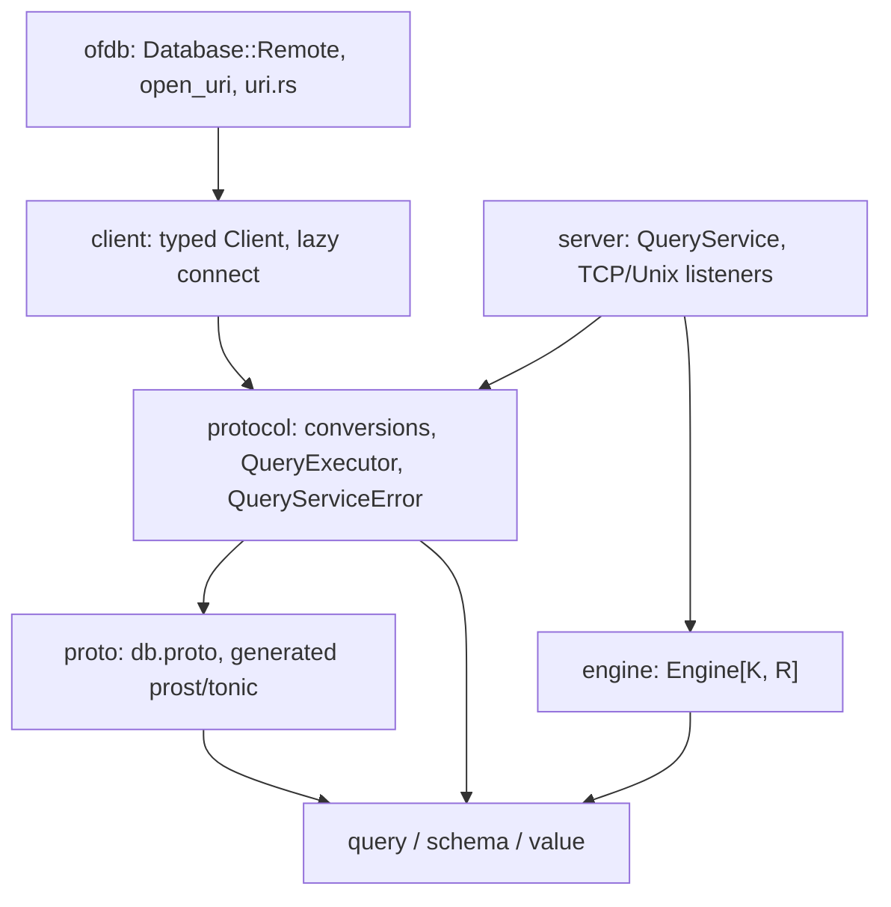

# gRPC Client/Server Protocol Plan

## Goal

Run one `Engine` in a server process and operate it from another process through
gRPC, using the existing `query::Statement` batch API as the only operation.

Done means all of the following:

- `ofdb+grpc://host:port` and `ofdb+unix:///path.sock` URIs open a
  `Database::Remote` that executes statement batches against the server.
- A server crate can serve any `Engine<K, R>` over TCP and Unix sockets with
  graceful shutdown.
- The protobuf schema represents every public `query`, `schema`, and `value`
  type losslessly; malformed or lossy requests are rejected before execution.
- One RPC maps to exactly one `Engine::execute` call, preserving the Engine
  transaction boundary (the batch commits together or the request fails).
- Local URI behavior is unchanged, and unsupported remote operations fail with
  explicit errors.

## Deliverables

| Crate             | Status     | Purpose                                                                 | Depends on                            | std |
| ----------------- | ---------- | ----------------------------------------------------------------------- | ------------------------------------- | --- |
| `crates/proto`    | fix + fill | `db.proto` and generated Prost/Tonic bindings. Generated code only.     | prost, tonic                          | yes |
| `crates/protocol` | new        | Proto ↔ domain conversions, `QueryExecutor` trait, `QueryServiceError`. | proto, query, schema, value           | yes |
| `crates/server`   | new        | Tonic service implementation, `Engine` adapter, TCP/Unix listeners.     | proto, protocol, engine, tonic, tokio | yes |
| `crates/client`   | new        | Typed client wrapper with lazy TCP/Unix connect.                        | proto, protocol, engine, tonic, tokio | yes |
| `ofdb` (root)     | extend     | `Database::Remote` variant, remote URI parsing, `remote` feature.       | client (optional)                     | —   |

Per-crate public API contracts:

```rust
// crates/protocol — no transport types, no engine types
pub enum QueryServiceError { Invalid(String), Rejected(String), Unsupported(&'static str), Internal(String) }
pub trait QueryExecutor: Send + Sync {
    fn execute(&self, statements: Vec<Statement>)
        -> impl Future<Output = Result<Vec<QueryResult>, QueryServiceError>> + Send;
}

// crates/server
pub struct QueryService<E> { /* Arc<E>, Clone */ }
impl<E: QueryExecutor> proto::query_service_server::QueryService for QueryService<E> { /* ... */ }
impl<K, R> QueryExecutor for Engine<K, R> where K: Kernel + 'static, R: RowCodec<K::Transaction> + Send + Sync + 'static { /* ... */ }
impl Server {
    pub fn tcp(addr: SocketAddr, executor: impl QueryExecutor + 'static) -> ServerBuilder;
    #[cfg(unix)]
    pub fn unix(path: PathBuf, executor: impl QueryExecutor + 'static) -> ServerBuilder;
}
// ServerBuilder: max_decoding_message_size(...), serve(shutdown: impl Future<Output = ()>)

// crates/client — no generated types leak past this boundary
impl Client {
    pub fn lazy_tcp(host: &str, port: u16) -> Result<Self, EngineError>;
    #[cfg(unix)]
    pub fn lazy_unix(path: &str) -> Result<Self, EngineError>;
    pub async fn execute(&self, statements: Vec<Statement>) -> EngineResult<Vec<QueryResult>>;
}
```

## Architecture



Layering rules:

- `protocol` never references tonic, tokio, or engine types. It is the only
  place wire↔domain conversion exists.
- `server` and `client` contain transport only: convert, delegate, map
  errors/status. No business logic.
- `proto` stays generated-code-only; its `lib.rs` remains two lines.
- Each future transport (HTTP, gRPC-Web, WebSocket) is a new adapter over
  `QueryExecutor`; it never touches conversions or the Engine.

## Design Decisions

1. **std-only for proto/protocol/server/client in v1.** Tonic codegen and
   tokio require std. Domain crates (`query`, `schema`, `value`) stay no_std;
   `protocol` touches only alloc types on the domain side, so a later
   no_std split (messages-only proto crate) stays mechanical. Browser and
   wasm clients arrive later via gRPC-Web/HTTP adapters, not this stack.
2. **`QueryExecutor` uses `impl Future` return style**, matching `Kernel` and
   `Translator` in this repo. No `async-trait`. The server is generic over
   `E: QueryExecutor`; the trait is not dyn-compatible and does not need to be.
3. **The `Engine` adapter lives in `crates/server`**, the only crate that runs
   an engine. `protocol` stays engine-free.
4. **Error mapping is deterministic per `EngineError` variant**, no string
   matching: `TranslateError` → `INVALID_ARGUMENT`, `Unsupported` →
   `UNIMPLEMENTED`, `InvalidQuery` → `FAILED_PRECONDITION`,
   `Custom`/`SyncDependencyUnavailable`/`MissingTimestampProvider` →
   `INTERNAL`. Structured error details wait until `EngineError` carries
   structured variants.
5. **Remote `Database` supports exactly the methods that reduce to an Execute
   batch** (see dispatch table). Everything else returns an explicit
   unsupported-operation error. Translation stays client-side.
6. **`database_call!` gains a remote arm** `|client| body` so every `Database`
   method dispatches all variants; unsupported remote methods pass a constant
   error expression.
7. **No retries, no request ids in v1.** Writes are not safe to retry without
   an idempotency contract.
8. **The protobuf sketch is rewritten freely** — it was never published (the
   crate is not even in the workspace). From the first release, reserve field
   numbers and names before any schema change.
9. **Lazy connect.** `Database::open_uri` stays synchronous; it builds a lazy
   Tonic channel (`connect_lazy` / `connect_with_connector_lazy`). The first
   operation surfaces connection errors through the existing async result.

## Wire Contract

`package db;` in `crates/proto/proto/db.proto`. One RPC:

```proto
service QueryService {
  rpc Execute(ExecuteRequest) returns (ExecuteResponse);
}
message ExecuteRequest  { repeated Statement statements = 1; }
message ExecuteResponse { repeated QueryResult results   = 1; }
```

The response has one result per submitted statement, in order. An empty batch
is `INVALID_ARGUMENT`. An absent or unknown `oneof` variant is an error, never
a default domain value. Prost's decode recursion limit (default 100) bounds
`QueryExpr` nesting; deeper input fails decode and maps to `INVALID_ARGUMENT`.

### Message inventory

Every message below must exist with exactly these fields. `google.protobuf.Empty`
represents unit-like variants (`Value::Null`, `QueryCountTarget::AllRows`,
`QueryInsertValue::Default`, `JsonValue::Null`).

| Rust type                                    | Proto definition rule                                                                                                                                                                               |
| -------------------------------------------- | --------------------------------------------------------------------------------------------------------------------------------------------------------------------------------------------------- |
| `value::ValueType`                           | `enum ValueType`, `VALUE_TYPE_UNSPECIFIED = 0`, then the 9 Rust variants in declaration order.                                                                                                      |
| `value::Value`                               | `oneof kind`: `null` (Empty), `type` (ValueType), `uuid` (bytes, exactly 16), `bool_value`, `integer` (int64), `float` (double), `text`, `json` (JsonValue), `blob` (bytes).                        |
| `value::JsonNumber`                          | `oneof kind`: `i64` (int64), `u64` (uint64), `f64` (double).                                                                                                                                        |
| `value::JsonValue`                           | Recursive: `oneof kind`: `null` (Empty), `bool_value`, `number` (JsonNumber), `string`, `array` (JsonArray), `object` (JsonObject).                                                                 |
| `value::JsonValue` object                    | `JsonObject { repeated JsonObjectEntry entries }`, `JsonObjectEntry { key, value }`. Repeated entries, not a map field: keeps `protocol` on `BTreeMap` and makes duplicate keys a conversion error. |
| `value::Row`                                 | `repeated Value values`.                                                                                                                                                                            |
| `schema::ColumnSchema`                       | `name`, `type` (ValueType), `default` (Value), `primary_key`.                                                                                                                                       |
| `schema::IndexSchema`                        | `name`, `table_name`, `repeated uint32 column_indices`, `unique`.                                                                                                                                   |
| `schema::TableSchema`                        | `name`, `repeated ColumnSchema columns`.                                                                                                                                                            |
| `query::QueryColumn`                         | `table`, `column`.                                                                                                                                                                                  |
| `query::QueryJoinKind` / `QueryJoin`         | Enum with `UNSPECIFIED = 0` + 4 kinds; message: `kind`, `table`, `on` (QueryExpr).                                                                                                                  |
| `query::QuerySortDirection` / `QueryOrderBy` | Enum with `UNSPECIFIED = 0` + 2 kinds; message: `by`, `direction`.                                                                                                                                  |
| `query::QueryExprValue`                      | `oneof`: `column`, `value`.                                                                                                                                                                         |
| `query::QueryExpr`                           | `oneof` with all 16 variants; `BinaryExpr { left, right }`, `InListExpr { expr, list, negated }`, `InSubqueryExpr { expr, subquery }`, `LikeExpr { expr, pattern }`.                                |
| `query::QueryCountTarget`                    | `oneof`: `all_rows` (Empty), `single` (string), `distinct` (string), `distinct_multi` (wrapper message; oneof fields cannot be repeated).                                                           |
| `query::QueryAggregate`                      | `oneof`: `count`, `sum`, `avg`, `min`, `max`.                                                                                                                                                       |
| `query::QueryFrom`                           | `table`, `repeated QueryJoin joins`.                                                                                                                                                                |
| `query::QueryUpdateAssignment`               | `column`, `value` (QueryExprValue).                                                                                                                                                                 |
| `query::QueryResultColumn`                   | `name`, `optional source_table`, `optional source_column`.                                                                                                                                          |
| `query::QueryResult`                         | `repeated Row rows`, `repeated QueryResultColumn columns`.                                                                                                                                          |
| `query::QuerySelect`                         | `from`, `projection`, `optional predicate`, `aggregates`, `group_by`, `order_by`, `optional uint64 limit`, `optional uint64 offset`, `optional having`.                                             |
| `query::QueryInsert`                         | `table`, `row`, `returning` (`ReturningStrings` wrapper).                                                                                                                                           |
| `query::QueryInsertValue`                    | `oneof`: `value`, `default` (Empty).                                                                                                                                                                |
| `query::QueryInsertValues`                   | `table`, `columns`, `values`, `returning` (`ReturningStrings` wrapper).                                                                                                                             |
| `query::QueryUpdate`                         | `from`, `assignments`, `optional predicate`, `returning` (`ReturningColumns` wrapper).                                                                                                              |
| `query::QueryDelete`                         | `from`, `optional predicate`, `returning` (`ReturningColumns` wrapper).                                                                                                                             |
| `query::Query`                               | `oneof`: `select`, `insert`, `insert_values`, `update`, `delete`.                                                                                                                                   |
| `query::AlterTableOperation`                 | `oneof`: `add_column`, `drop_column`, `rename_column`, `rename_table`, `add_index`, `rename_index`, `drop_index`; with `RenameColumn`, `RenameTable`, `RenameIndex` messages.                       |
| `query::AlterIndexOperation`                 | `oneof`: `rename` (`RenameIndexOp { new_name }`).                                                                                                                                                   |
| `query::DataDefinition`                      | `oneof` with all 8 variants and their payload messages (`CreateTable`, `CreateTableWithIndexes`, `AlterTable`, `DropTable`, `CreateIndex`, `CreateIndexUnresolved`, `AlterIndex`, `DropIndex`).     |
| `query::Statement`                           | `oneof`: `query`, `data_definition`.                                                                                                                                                                |

Presence rules:

- `ReturningStrings { repeated string columns = 1 }` and
  `ReturningColumns { repeated QueryColumn columns = 1 }` wrap optional
  repeated fields; protobuf repeated fields have no presence, wrapper messages
  do. Absent wrapper ≠ present empty list.
- `optional` scalars only where Rust has `Option`: `limit`, `offset`,
  `predicate`, `having`, `source_table`, `source_column`.
- `usize` ↔ `u64` for `limit`/`offset` uses checked conversion; overflow is a
  conversion error.
- Delete the placeholder `Value`, the incomplete schema messages, and the
  unused `QueryInsertValueKind` enum during the rewrite.

### Error mapping

| Condition                                          | gRPC status           |
| -------------------------------------------------- | --------------------- |
| Malformed protobuf, failed conversion, empty batch | `INVALID_ARGUMENT`    |
| `EngineError::Unsupported`                         | `UNIMPLEMENTED`       |
| `EngineError::InvalidQuery`                        | `FAILED_PRECONDITION` |
| `EngineError::TranslateError`                      | `INVALID_ARGUMENT`    |
| Other `EngineError` variants, storage faults       | `INTERNAL`            |
| Deadline expires                                   | `DEADLINE_EXCEEDED`   |

Status messages stay concise. Do not expose backend implementation strings as
a stable client contract. Typed protobuf error details wait for structured
`EngineError` variants.

## Remote Database Integration

### URI grammar

Extend `src/uri.rs` without changing local behavior:

| URI                      | Parsed result                        | Required feature          |
| ------------------------ | ------------------------------------ | ------------------------- |
| `:in_memory:`            | `UriScheme::InMemory`                | `in-memory` + `automerge` |
| `ofdb://<path>`          | `UriScheme::File` + path             | `redb` + `automerge`      |
| `ofdb+grpc://host:port`  | `UriScheme::Grpc` + `Endpoint::Tcp`  | `remote`                  |
| `ofdb+grpcs://host:port` | rejected, `UriError::TlsUnsupported` | future `tls`              |
| `ofdb+unix:///<path>`    | `UriScheme::Unix` + `Endpoint::Unix` | `remote` (cfg(unix))      |

- `UriScheme` gains `Grpc`, `Grpcs`, `Unix`. `Uri` gains
  `endpoint: Option<Endpoint>` where `Endpoint` is
  `Tcp { host, port } | Unix { path }`. `UriError` gains `InvalidEndpoint` and
  `TlsUnsupported`.
- Hosts may be DNS names, IPv4, or bracketed IPv6. Reject: userinfo (`@`),
  query (`?`), fragment (`#`), missing/empty host, non-numeric or out-of-range
  port, and non-empty authority in Unix URIs.
- The remote URI identifies the server endpoint only. A server process owns
  the database instance; there is no database name component.

### `Database` dispatch

`Database::Remote(Client)` is added behind the `remote` feature. `open_uri`
maps parsed endpoints to `Client::lazy_tcp` / `Client::lazy_unix`; when
`remote` is disabled, remote schemes return a feature-disabled error naming
the feature.

| `Database` method                                                                                                    | Remote behavior                                    |
| -------------------------------------------------------------------------------------------------------------------- | -------------------------------------------------- |
| `execute`                                                                                                            | `Client::execute(statements)`                      |
| `translate_and_execute`, `translate_and_execute_with_params`                                                         | translate locally, then `Client::execute`          |
| `translate_and_select`                                                                                               | translate + execute remotely, then `rows_as`       |
| `create_table`, `drop_table`                                                                                         | build the `DataDefinition` statement, then execute |
| `index_schema`, `index_lookup`, `table_schema`, `table_generation_id`, `column_generation_id`, `index_generation_id` | unsupported-operation error                        |
| `sync_manifest`, `export_sync_state`, `apply_sync_state` (`sync` feature)                                            | unsupported-operation error                        |
| `row_conflicts`, `resolve_row`                                                                                       | unsupported-operation error                        |

## Implementation Checklist

### Phase 0 — Repair the workspace foundation

`crates/proto` is currently unbuildable: it is not a workspace member and its
`workspace = true` dependencies do not exist. Nothing else can proceed until
`cargo check -p proto` passes.

- [ ] Add `[workspace.dependencies]` to the root `Cargo.toml`: `prost`,
      `prost-types`, `tonic`, `tonic-prost`, `tonic-prost-build`, `tokio`.
      Major.minor versions, `default-features = false`, full table form,
      grouped under a `# gRPC` comment header, alphabetized.
- [ ] Add `crates/proto` to `[workspace] members`; switch its dependency table
      to the workspace entries; enable only required tonic features
      (`codegen`, `prost`).
- [ ] Verify: `cargo check -p proto`.

### Phase 1 — Canonical protobuf schema

- [ ] Rewrite `crates/proto/proto/db.proto` to the message inventory above;
      add `QueryService`, `ExecuteRequest`, `ExecuteResponse`.
- [ ] Regenerate bindings via the existing `tonic-prost-build` build script.
- [ ] Verify: `cargo check -p proto` and `cargo test -p proto` after adding a
      golden-fixture test that encodes fixed v1 byte sequences for `Value`,
      `QueryExpr`, and `Statement` and decodes them with the bindings.

### Phase 2 — `crates/protocol`

- [ ] Create the crate: deps `proto`, `query`, `schema`, `value` (all
      `default-features = false`); thin `lib.rs` declaring flat modules.
- [ ] Add `error.rs`: `QueryServiceError` with `Invalid`, `Rejected`,
      `Unsupported`, `Internal`.
- [ ] Add `executor.rs`: the `QueryExecutor` trait.
- [ ] Add conversion modules `value.rs`, `schema.rs`, `query.rs`, `result.rs`:
      `From<domain> for proto` where infallible, `TryFrom<proto> for domain`
      with `QueryServiceError::Invalid` as the error type.
- [ ] Enforce losslessness: absent `oneof` and unknown enum values error;
      UUID bytes must be exactly 16; duplicate `JsonObjectEntry` keys error;
      `limit`/`offset` use checked `u64 → usize`.
- [ ] Unit-test every conversion module: all 9 `Value` variants, all
      `JsonValue` shapes, every absent-`oneof` case, `returning` presence
      distinction (absent vs empty), overflow, duplicate JSON keys, and
      round-trips in both directions for representative nested expressions,
      DDL, and results.
- [ ] Verify: `cargo test -p protocol`.

### Phase 3 — `crates/server`

- [ ] Create the crate: deps `proto`, `protocol`, `engine`, `tonic`
      (transport/server features), `tokio` (`net`); dev-deps `tokio`
      (`rt-multi-thread`, `macros`), `engine-automerge`, `futures`.
- [ ] Add `executor.rs`: `impl QueryExecutor for Engine<K, R>` mapping
      `EngineError` variants per the error table.
- [ ] Add `service.rs`: `QueryService<E>` implementing the generated server
      trait — validate and convert the request, call the executor once,
      convert the response or map `QueryServiceError` to `Status`.
- [ ] Add `server.rs`: `Server::tcp` / `Server::unix` builders with
      `max_decoding_message_size` (default: tonic's 4 MiB) and
      `serve(shutdown)`. Unix bind fails if the socket file exists; the caller
      owns socket-file lifecycle. Also expose `QueryService` for mounting into
      a caller-owned `tonic::Server`.
- [ ] Integration tests over loopback TCP with an in-memory engine: ordered
      batch results equal to direct `Engine::execute`, empty batch →
      `INVALID_ARGUMENT`, unsupported shape → `UNIMPLEMENTED`, invalid query →
      `FAILED_PRECONDITION`, atomic failure of a write batch, deadline
      handling. Unix test behind `cfg(unix)`.
- [ ] Verify: `cargo test -p server`.

### Phase 4 — `crates/client`

- [ ] Create the crate: deps `proto`, `protocol`, `engine`, `tonic`
      (transport/channel features); optional `tokio` (`net`) behind `unix`.
- [ ] Add `client.rs`: `Client::lazy_tcp`, `Client::lazy_unix` (Unix connector
      via `Endpoint::connect_with_connector_lazy` + `tower::service_fn` over
      `tokio::net::UnixStream`, dummy `http://` endpoint URI), and
      `execute` converting statements/results through `protocol`.
- [ ] Map tonic `Status` failures to `EngineError::custom` with the status
      code and message included; unit-test the mapping.
- [ ] Verify: `cargo test -p client`.

### Phase 5 — Root integration

- [ ] `src/uri.rs`: add the remote schemes, `Endpoint`, validation rules, and
      unit tests for every accept/reject case in the URI grammar table.
- [ ] `src/database.rs`: add `Database::Remote(Client)` behind `remote`;
      extend `database_call!` with the remote arm; wire the supported-method
      table; return the unsupported-operation error for the rest.
- [ ] `src/database.rs`: dispatch `open_uri` to lazy client constructors;
      keep local variants and error messages unchanged.
- [ ] Root `Cargo.toml`: optional `client` dependency and `remote` feature
      (`dep:client` + `client/unix`); add a `[[test]] remote` entry with
      `required-features = ["remote", "sql", "automerge", "in-memory"]`.
- [ ] Add `tests/remote.rs`: local URIs unchanged, valid remote URIs construct
      a lazy `Database::Remote`, remote schemes error when `remote` is
      disabled, unsupported remote methods error, and an end-to-end execute
      against a spawned in-memory server (TCP; Unix variant behind
      `cfg(unix)`).
- [ ] Verify: `cargo test --test remote --features remote,sql,automerge,in-memory`.

### Phase 6 — Full validation

- [ ] `just fmt-check`
- [ ] `just clippy`
- [ ] `just test` (feature-powerset across the workspace)
- [ ] `just crap`
- [ ] Document the URI schemes, the `remote` feature, and the server/client
      crate usage in `README.md`.

## Acceptance Criteria

- `Database::open_uri("ofdb+grpc://host:port")` and
  `Database::open_uri("ofdb+unix:///path.sock")` return a lazy
  `Database::Remote`; the first operation connects and surfaces connection
  errors through the existing async result.
- A Tonic client submitting a valid `ExecuteRequest` over TCP or Unix receives
  ordered `QueryResult` values identical to direct `Engine::execute`, and one
  request executes exactly one Engine statement batch.
- Malformed, lossy, or empty requests are rejected before execution with the
  mapped status codes.
- Remote `execute` and the translation methods behave like local ones;
  `create_table`/`drop_table` work remotely; all other remote methods return
  explicit unsupported-operation errors.
- Local URI behavior is unchanged; remote schemes fail clearly when `remote`
  is disabled or the platform lacks Unix sockets.
- The protobuf schema represents all public `query`, `schema`, and `value`
  data with no placeholders and no silent semantic loss, including
  `Option<Vec<_>>` presence distinctions.
- Adding an HTTP, gRPC-Web, or WebSocket adapter requires only a new adapter
  over `QueryExecutor`; conversions and Engine behavior are untouched.
- `just test` passes across the feature powerset.

## Out of Scope (v1)

- Authentication, authorization, tenant routing, TLS (`ofdb+grpcs` is
  reserved and rejected).
- Server-side SQL translation and query parameters.
- Metadata, replication, sync, checkpoint, and conflict-resolution RPCs.
- Streaming/cursor RPCs; the wire contract is unary request/response.
- gRPC-Web, plain-HTTP, and WebSocket adapters; define their framing only when
  a concrete consumer exists.
- Retries and idempotency contracts.
